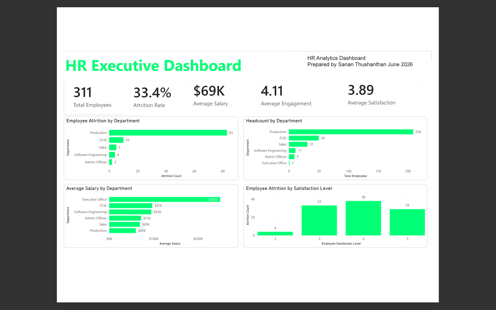
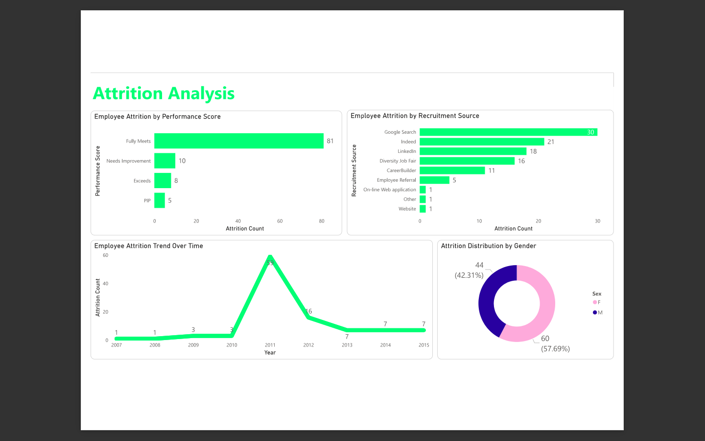
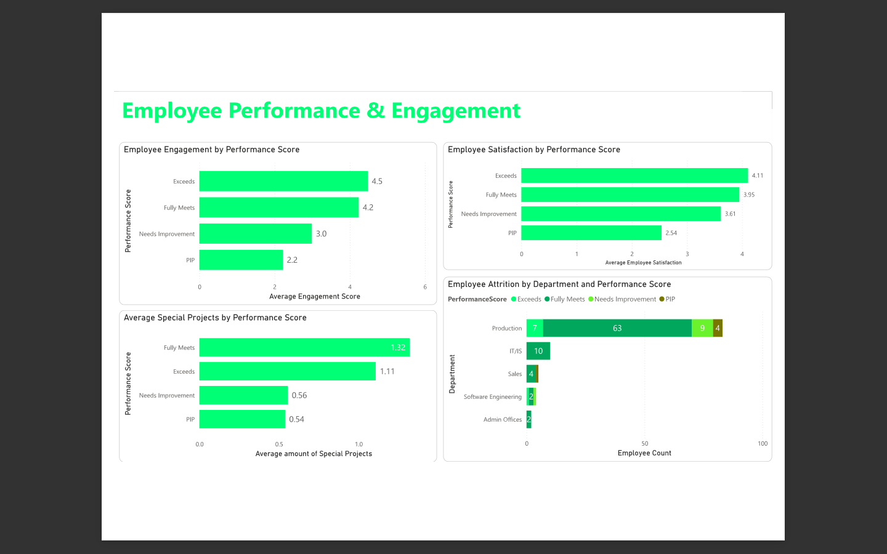
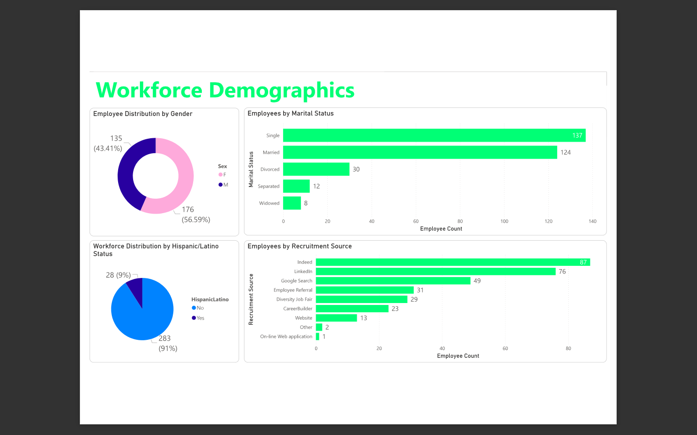
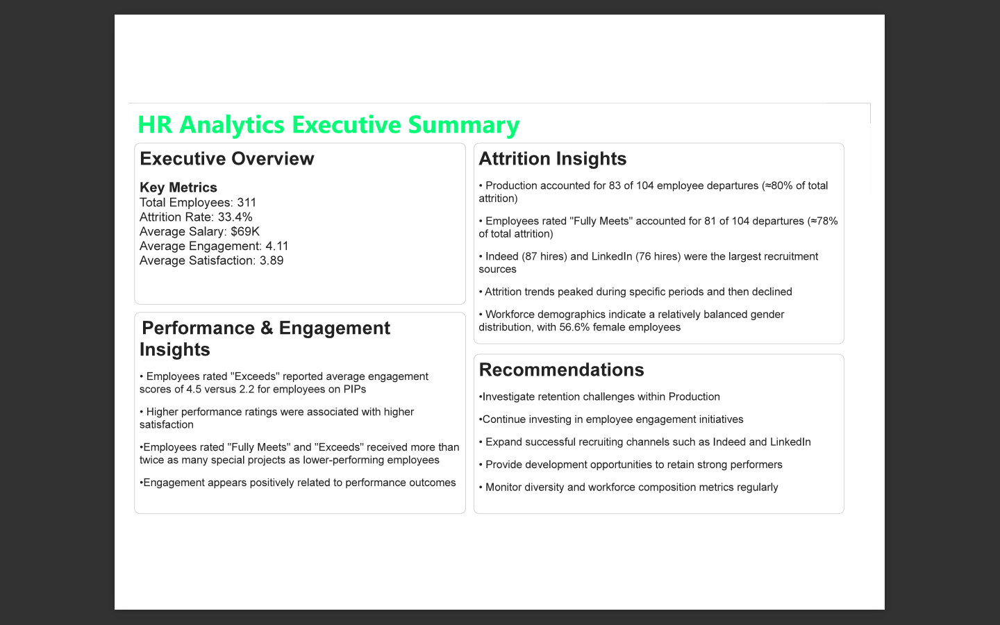

# People Analytics Executive Dashboard

## Overview

Developed a multi-page Power BI dashboard analyzing workforce demographics, attrition, engagement, satisfaction, and recruitment metrics.

## Tools

- Power BI
- DAX
- Power Query

## Key Features

- Executive Dashboard
- Attrition Analysis
- Performance & Engagement Analysis
- Workforce Demographics
- Executive Summary & Recommendations

## Skills Demonstrated

- Dashboard Development
- KPI Reporting
- Data Visualization
- HR Analytics
- Business Analysis
- Data Storytelling

## Files

- HR Dashboard.pbix
- Sanan_Thushanthan_HR_Dashboard.pdf

## Dashboard Preview

### Executive Dashboard

### Attrition Analysis

### Performance & Engagement

### Workforce Demographics

### Executive Summary

